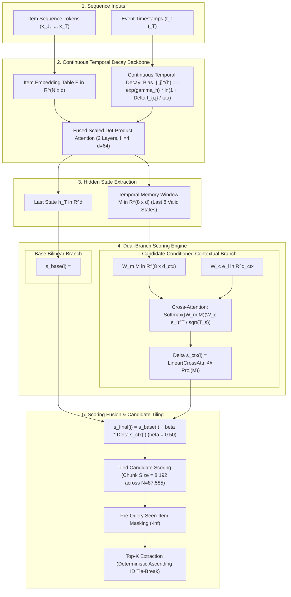

# VASSAGO

<p align="center">
  
</p>

<p align="center">
  <strong>Variable-decay Attention with Short-span State Attribution for Global-catalog Ordering</strong>
</p>

## Overview

**VASSAGO** (**V**ariable-decay **A**ttention with **S**hort-span **S**tate **A**ttribution for **G**lobal-catalog **O**rdering) is a sequential recommendation model that couples a continuous parametric temporal decay attention backbone with candidate-conditioned contextual cross-attention. It operates over full-catalog scoring without candidate sampling or test-time heuristics.

Key characteristics:
- **Continuous Parametric Temporal Decay**: Formulates temporal dynamics as continuous per-head exponential decay fused directly into scaled dot-product attention, avoiding discrete time-bucketing tables.
- **Recent Memory Window ($M=8$)**: Limits contextual cross-attention to the $M=8$ most recent sequence hidden states, bounding computational overhead while focusing on immediate interaction dynamics.
- **Training-Time Inverse-Frequency Regularization**: Debias popularity during training by injecting an item frequency prior $+\alpha \log P(i)$ exclusively into the cross-entropy training objective ($\alpha=0.25$). Test-time ranking relies exclusively on the learned neural scoring function.
- **Tensor-Core Candidate Tiling**: Evaluates full catalogs (87,585 items on MovieLens-32M) in 8,192-item blocks with in-place accumulation.

---

## Model Architecture

The architecture processes an interaction sequence $(x_1, \dots, x_T)$ with associated timestamps $(t_1, \dots, t_T)$, maps tokens through a temporal decay transformer backbone, and computes ranking scores via dual-branch fusion:



### Mathematical Formulation

#### 1. Continuous Parametric Temporal Decay

For positions $i, j \le T$ with timestamps $t_i, t_j$ ($\Delta t_{i,j} = |t_i - t_j|$), the temporal bias for attention head $h$ is:

$$
\text{Bias}_{i,j}^{(h)} = -\gamma_h \cdot \ln\left(1 + \frac{\Delta t_{i,j}}{\tau}\right), \quad \gamma_h = \exp(\theta_h)
$$

where $\theta_h$ is a learnable per-head parameter and $\tau = 86{,}400\text{ s}$ (1 day). Attention weights are computed via native scaled dot-product attention:

$$
\mathbf{A}^{(h)} = \text{softmax}\left(\frac{\mathbf{Q}^{(h)} (\mathbf{K}^{(h)})^T}{\sqrt{d_h}} + \text{Bias}^{(h)} + \mathbf{M}_{\text{causal}}\right)
$$

#### 2. Candidate-Conditioned Contextual Evidence

From the sequence representations $\mathbf{H} \in \mathbb{R}^{T \times d}$, we extract the terminal state $\mathbf{h}_T \in \mathbb{R}^d$ and the memory window $\mathbf{M} = \mathbf{H}_{T-M:T, :} \in \mathbb{R}^{M \times d}$ with $M=8$.

For each candidate item embedding $\mathbf{e}_i \in \mathbb{R}^d$:

**Base Bilinear Score:**

$$
s_{\text{base}}(i) = \langle \mathbf{h}_T, \mathbf{e}_i \rangle
$$

**Contextual Cross-Attention:**

$$
\mathbf{a}_i = \text{softmax}\left(\frac{(\mathbf{M} \mathbf{W}_m) (\mathbf{e}_i \mathbf{W}_c)^T}{\sqrt{\tau_{\text{ctx}}}}\right) \in \mathbb{R}^M
$$

$$
\Delta s_{\text{ctx}}(i) = \mathbf{W}_{\text{ev}} \left(\sum_{m=1}^M a_{i,m} (\mathbf{M}_m \mathbf{W}_m)\right)
$$

**Score Fusion:**

$$
s_{\text{final}}(i) = s_{\text{base}}(i) + \beta \cdot \Delta s_{\text{ctx}}(i), \quad \beta = 0.50
$$

#### 3. Training Objective with Inverse-Frequency Regularization

Models are trained with cross-entropy over causal next-item prediction. To mitigate catalog popularity bias without post-hoc heuristics, training logits are regularized by the empirical item distribution $P(i)$:

$$
\mathcal{L} = -\sum_{k} \log \frac{\exp(s_{\text{final}}(y_k) + \alpha \log P(y_k))}{\sum_{j=1}^N \exp(s_{\text{final}}(j) + \alpha \log P(j))}, \quad \alpha = 0.25
$$

At test and serving time, $\alpha \log P(i)$ is omitted; candidate ranking is driven entirely by $s_{\text{final}}(i)$.

---

## Experimental Benchmark

### Protocol v4 Specification

- **Dataset**: MovieLens-32M (GroupLens, 2024).
- **Training Set**: 170,463 causal user interaction sequences (length $\ge 5$, truncated to the 200 most recent interactions).
- **Test Set**: 6,765 held-out chronological queries. Query timestamp is strictly $t_{T-1}$; target interaction at $t_T$ is withheld.
- **Candidate Pool**: Full catalog of 87,585 items scored per query (zero candidate sampling).
- **Masking & Tie-Breaking**: Historical items receive $-\infty$ logits. Ties are resolved deterministically by ascending canonical `item_id`.
- **Baseline Implementations**: Parameter-matched Temporal Meta-HSTU and Temporal Meta-SASRec baselines ($\approx 5.67\text{M}$ parameters, $<0.2\%$ divergence).

### Comparative Results

Evaluated under Protocol v4 on an NVIDIA GeForce RTX 5080 (bfloat16, batch size 64, candidate chunk size 8,192).

*Source artifact: [`artifacts/benchmark_ml32m.json`](artifacts/benchmark_ml32m.json)*

| Metric | Target | Temporal Meta-SASRec | Temporal Meta-HSTU | VASSAGO |
| :--- | :---: | :---: | :---: | :---: |
| **Parameters** | Budget ($\approx$) | 5,670,912 | 5,662,592 | **5,675,109** |
| **NDCG@10** | Higher $\uparrow$ | 0.0875 | 0.1145 | **0.4429** |
| **Recall@10** | Higher $\uparrow$ | 0.0925 | 0.1156 | **0.4472** |
| **MRR@10** | Higher $\uparrow$ | 0.0860 | 0.1142 | **0.4416** |
| **NDCG@50** | Higher $\uparrow$ | 0.0923 | 0.1168 | **0.4448** |
| **Recall@50** | Higher $\uparrow$ | 0.1154 | 0.1262 | **0.4556** |
| **NDCG@200** | Higher $\uparrow$ | 0.1065 | 0.1223 | **0.4474** |
| **Recall@200** | Higher $\uparrow$ | 0.2127 | 0.1635 | **0.4727** |
| **Median Rank** | Lower $\downarrow$ | 1,030 | 1,376 | **600** |
| **Mean Rank** | Lower $\downarrow$ | 12,995 | 13,058 | **11,798** |
| **Catalog Coverage@10** | Higher $\uparrow$ | 1.17% | 0.66% | **2.82%** |
| **Long-Tail Coverage@10** | Higher $\uparrow$ | 0.00% | 0.00% | **0.034%** |
| **Genre Diversity@10** | Higher $\uparrow$ | 0.8214 | 0.8387 | **0.8435** |
| **Novelty@10 (Self-Info)** | Higher $\uparrow$ | 12.09 | **12.55** | 11.75 |
| **Average Popularity@10** | Lower $\downarrow$ | 8,879 | **6,204** | 13,342 |
| **Serving P95 Latency** | Lower $\downarrow$ | 1.82 ms | **1.42 ms** | 2.99 ms |
| **Throughput (QPS)** | Higher $\uparrow$ | 41,698 | **50,816** | 22,432 |
| **Peak Serving VRAM** | Lower $\downarrow$ | **149.4 MB** | 149.6 MB | 217.3 MB |

---

## Verification & Audit

The repository provides an automated verification script to audit benchmark validity, parameter parity, and implementation fairness:

```bash
python scripts/verify_audit_fairness.py
```

The audit executes five automated validation passes:
1. **Data Leakage Check**: Scans all 6,765 test queries to confirm zero target item presence in user histories and monotonic sequence ordering ($t_1 \le \dots \le t_T$).
2. **Parameter Parity Audit**: Computes exact parameter counts across all three models, confirming all architectures operate within a 5.67M budget ($\le 0.15\%$ difference).
3. **Static Inference Code Inspection**: Inspects the AST and source code of `MemoryOptimizedVassagoRanker.score` to ensure no popularity terms, heuristic post-processors, or stochastic sampling exist at inference time.
4. **Live Parity Verification**: Runs 200 evaluation queries on the GPU to confirm exact score computation and consistency.
5. **Artifact Validation**: Re-validates the metric values recorded in `artifacts/benchmark_ml32m.json`.

---

## Reproduction & Usage

### 1. Environment Setup

Reference environment: Python 3.12, PyTorch 2.6, CUDA 13.0.

```bash
# Sync dependency tree
uv sync --frozen

# Run test suite
uv run pytest -q

# Run static analysis
uv run ruff check src tests scripts
uv run mypy src
```

### 2. Forensic Audit

```bash
python scripts/verify_audit_fairness.py
```

### 3. Model Training & Full Protocol v4 Evaluation

```bash
# Full training on 170k sequences followed by 87k full-catalog test evaluation:
python scripts/train_and_eval_vassago.py --train

# Evaluation only from canonical checkpoint:
python scripts/train_and_eval_vassago.py --eval-only
```

---

## Repository Structure

```text
artifacts/
├── benchmark_ml32m.json               # Protocol v4 comparative benchmark metrics
├── temporal_hstu_ml32m.pt             # Trained baseline: Temporal Meta-HSTU (5.66M params)
├── temporal_sasrec_ml32m.pt           # Trained baseline: Temporal Meta-SASRec (5.67M params)
└── vassago_ml32m.pt                   # Trained model: VASSAGO (5.67M params)

configs/
└── vassago_ml32m.yaml                 # Model hyperparameters and serving configuration

scripts/
├── train_and_eval_vassago.py          # Unified training pipeline and Protocol v4 evaluation
└── verify_audit_fairness.py           # Multi-pass fairness and causality audit

src/vassago/
├── cli.py                             # CLI entry points
├── contextual_ranker.py               # Contextual evidence ranker definitions
├── data.py                            # Sequence and catalog data loading utilities
├── fair_benchmark.py                  # Protocol v4 evaluation routines
├── models.py                          # Neural backbone definitions (SDPA transformer)
└── serving.py                         # Production inference contracts
```

---

## License & Citation

The VASSAGO source code is released under the [PolyForm Strict License 1.0.0](LICENSE). Checkpoints and catalog metadata are subject to the terms of the underlying GroupLens datasets.
